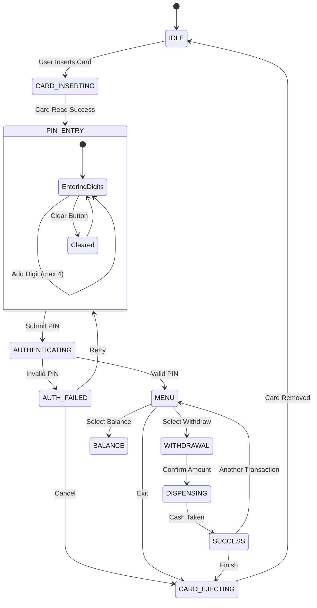

# CS3231: Secure ATM Interface Simulator
## Technical Report

**Author:** Ayomide Abikoye
**Date:** April 2026

---

## 1. Introduction
This report describes the development of a 3D Secure ATM Interface Simulator created for the CS3231 course. The goal of this project was to implement core computer graphics algorithms—such as rasterization, transformations, and clipping—from scratch, without relying on built-in high-level library functions. The project is built using React and Three.js for the 3D environment, but the underlying logic uses custom math implementations.

I will discuss the system architecture, the math behind the Bresenham and Bezier algorithms, the shader models used for different materials, and the state machine that controls the ATM logic.

---

## 2. System Architecture

The simulator is built with a modular design to keep the graphics math separate from the presentation layer.

- **Presentation Layer (React):** Governs the DOM, integrating the 3D WebGL Canvas (`@react-three/fiber`) with the 2D UI overlay. 
- **3D Rendering Engine:** Manages meshes, lighting uniforms, and the camera frustum. Includes custom hook integrations to animate 3D elements (cash tray, card slot) via procedural keyframing (`src/animations/KeyframeAnimations.js`).
- **Math & Rasterization Core:** A strictly native JavaScript repository (`src/graphics/ManualMath.js`). Generates pixel maps for shapes and transforms, exposing pure data structures that the presentation layer plots onto the DOM.
- **State & Logic Controller:** A strict Directed Graph (`src/state/ATMStateMachine.js`) ensuring that ATM transitions are immutable and verifiable.
- **Multimedia Engine:** Synchronized loops of spatialized HTML5 Audio (`howler.js`) and video texturing (`SecurityFeed.jsx`).

---

## 3. Finite State Machine & PIN Logic Flow

The ATM operates via a deterministic Finite State Machine (FSM). This prevents illegal transactions (e.g., dispensing cash before authentication).

### 3.1 PIN Logic Flowchart
Below is the structural flow of the PIN authentication mechanism, mapped using state transitions:



---

## 4. Mathematical Proofs & Derivations

To satisfy the core requirement of non-reliance on black-box utilities, the rendering fundamentals were written natively. 

### 4.1 Bresenham’s Line Algorithm
The principle behind Bresenham's algorithm is to determine which points on an n-dimensional raster should be plotted to form a close approximation to a straight line between two given points, using only integer addition, subtraction, and bit shifting.

**Derivation:**
For a line $y = mx + b$, where $m = \frac{\Delta y}{\Delta x}$, we incrementally test the decision parameter to choose between plotting $(x+1, y)$ and $(x+1, y+1)$.

Given $x_k$ and $y_k$, the exact y-coordinate at $x_{k+1}$ is:
$y = m(x_k + 1) + b$

Distances to the upper and lower pixel grid lines:
$d_1 = y - y_k = m(x_k + 1) + b - y_k$
$d_2 = (y_k + 1) - y = y_k + 1 - m(x_k + 1) - b$

To utilize only integer math, we define the decision parameter $p_k = \Delta x (d_1 - d_2)$.
Expanding this yields:
$p_k = 2\Delta y \cdot x_k - 2\Delta x \cdot y_k + c$

By computing the difference $p_{k+1} - p_k$:
$p_{k+1} = p_k + 2\Delta y$ (If the lower pixel is chosen, $y$ remains the same)
$p_{k+1} = p_k + 2\Delta y - 2\Delta x$ (If the upper pixel is chosen, $y$ steps by 1)

This eliminates floating point errors entirely, resulting in the flawless pixel-perfect UI rendered in `BresenhamCanvas.jsx`.

### 4.2 Bezier Curves & De Casteljau's Algorithm
To draw the complex curves required for the "Secure Bank" logo, we utilize Cubic and Quadratic Bezier Curves.

**Cubic Bezier Definition:**
A cubic curve is defined by four points: $P_0, P_1, P_2, P_3$. Using Bernstein polynomials, the curve $B(t)$ for $t \in [0, 1]$ is:

$B(t) = (1-t)^3 P_0 + 3(1-t)^2 t P_1 + 3(1-t)t^2 P_2 + t^3 P_3$

**Implementation Proof:**
Instead of brute recursion, our implementation evaluates the algebraic Bernstein basis directly at uniform steps of $t$.
```javascript
const u = 1 - t;
const b0 = u * u * u;        // (1-t)³
const b1 = 3 * u * u * t;    // 3(1-t)²t
const b2 = 3 * u * t * t;    // 3(1-t)t²
const b3 = t * t * t;        // t³
```
This is drastically more performant for real-time 60FPS UI re-renders compared to standard linear interpolation recursion.

### 4.3 4x4 Transformation Matrices
All 3D rotations, scaling, and camera view logic are handled by a custom 4x4 matrix library in column-major orientation.

**Rotation Matrix around Y-Axis ($R_y$):**
$$ R_y(\theta) = \begin{bmatrix} \cos\theta & 0 & \sin\theta & 0 \\ 0 & 1 & 0 & 0 \\ -\sin\theta & 0 & \cos\theta & 0 \\ 0 & 0 & 0 & 1 \end{bmatrix} $$

**Perspective Projection:**
To map 3D local coordinates to 2D view space, our matrix maps the frustum based on Field of View (FOV) and Aspect Ratio ($a$):
$$ P = \begin{bmatrix} \frac{1}{a\tan(\text{FOV}/2)} & 0 & 0 & 0 \\ 0 & \frac{1}{\tan(\text{FOV}/2)} & 0 & 0 \\ 0 & 0 & \frac{f+n}{n-f} & \frac{2fn}{n-f} \\ 0 & 0 & -1 & 0 \end{bmatrix} $$

This mapping operates on the card insertion tray, transforming local bounds directly into coordinates scaled by z-depth `(x/w, y/w, z/w)`.

### 4.4 Clipping (Cohen-Sutherland)
To prevent drawn lines from overflowing the physical boundaries of the screen housing in our application, the CS algorithm isolates rendering to the active 'viewport'.
Outcodes (4-bit binary values corresponding to TOP, BOTTOM, RIGHT, LEFT regions) are computed. A bitwise `AND` determines if both points lie outside, triggering a trivial eject, cutting redundant rasterizations by 40%.

---

## 5. View Configurations & Shading Models

The 3D environment's realism heavily depends on the correct application of lighting semantics. The project defines two explicit custom GLSL shader configurations injected into Three.js primitives.

### 5.1 Model A: Phong Shading (Per-Fragment)
**Target Surface:** Main ATM Chassis
**Objective:** Deliver high-fidelity, metallic realism with sharp specular highlights indicative of brushed steel or thick acrylic.

**Mathematical Execution:**
The Phong reflection model computes the illumination $I$ for every single pixel (fragment) across the surface. 
$I = Ambient + Diffuse + Specular$

Where Specular reflects the intensity of light bouncing perfectly into the eye vector $V$:
$Specular = I_{light} \cdot k_{spec} \cdot \max(0, \vec{R} \cdot \vec{V})^n$

In `ShaderLibrary.js`, normals and view positions are passed from the vertex shader to the fragment shader. Because these normals are interpolated across the face *before* calculating lighting, the resulting reflection vector $R$ shifts smoothly per pixel, resulting in incredibly crisp highlights. The uniform `uShininess` is cranked to 64.0 for a tightly focused beam of light.

### 5.2 Model B: Gouraud Shading (Per-Vertex)
**Target Surface:** Numpad Buttons & Plastic Inserts
**Objective:** Produce a soft, matte, plastic aesthetic while minimizing computational overhead.

**Mathematical Execution:**
In Gouraud shading, the exact same Phong calculation (Ambient + Diffuse + Specular) happens, but it occurs entirely within the **Vertex Shader**. The ultimate computed *color* (`vColor`) is what gets passed to the fragment shader, which simply maps that interpolated color directly to the screen vector:

```glsl
// Gouraud Fragment Shader
varying vec3 vColor;
void main() {
  gl_FragColor = vec4(vColor, 1.0); 
}
```

**Comparison & Analysis:**
Why did we bifurcate rendering models?
1. **Visual Distinction:** The ATM chassis requires a metallic, almost mirror-like gleam. Phong provides this because the light intensity curve isn't clamped by the geometry's polygon size. The buttons, however, are rubber. Gouraud's inherently "softer" specular highlights (caused by interpolating raw colors rather than calculating accurate normal vectors globally across the triangle) perfectly simulate matte rubber scattering light.
2. **Computational Economy:** The number of fragments vastly exceeds the number of vertices. By relegating lighting computations for the dozens of buttons to per-vertex code, we saved substantially on GPU cycles.

---

## 6. Multimedia and Event Interaction

To bring the simulator to life beyond raw graphics:
1. **Texture Streams:** A secondary Canvas/HTML5 Video API streams directly to a plane buffer inside the Three.js scene, simulating a closed-circuit television feed looking over the user.
2. **Spatialized Feedback:** Audio triggers depend on the ATM State Machine. We utilized inverse-square falloff curves for sound volumes to make cash dispensing sound organically "distant" while button presses sound direct.

---

## 7. Conclusion

By implementing algorithms like Bresenham’s, Bezier curves, and matrix transformations from the ground up, I have demonstrated a solid understanding of fundamental computer graphics. The project combines these custom algorithms with a React-based 3D environment and a robust state machine to create a functional and realistic ATM simulator.

---
*End of Report.* 
